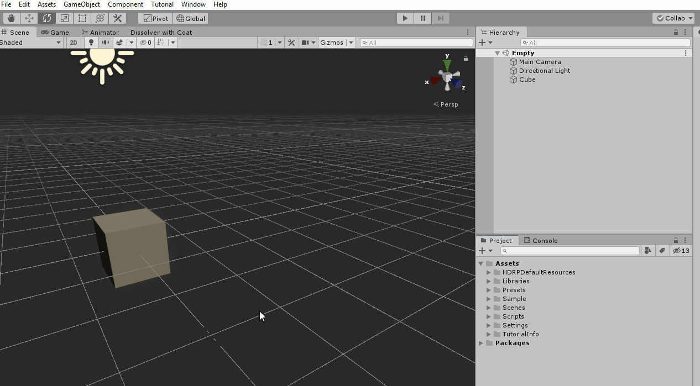
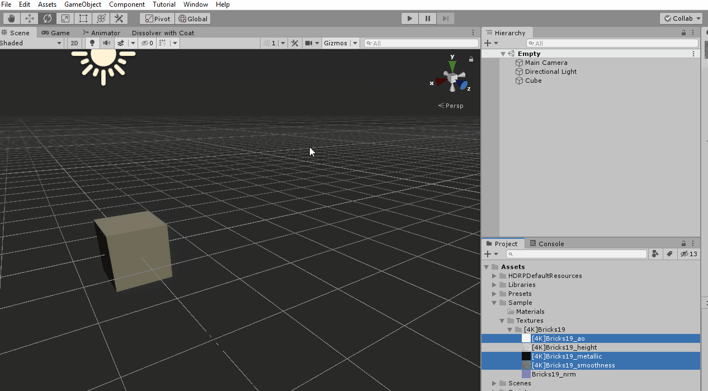
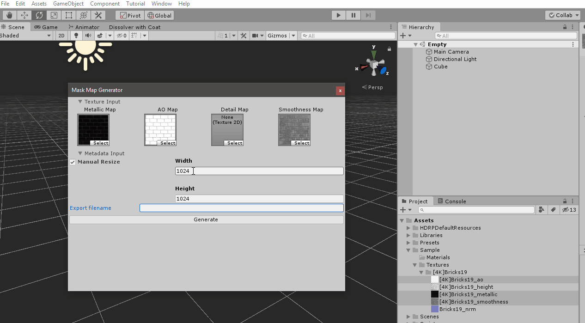
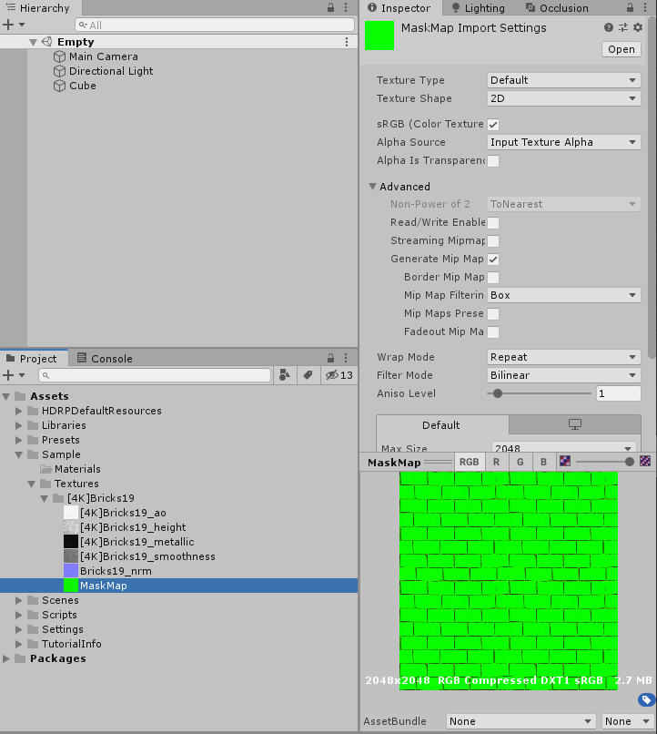

*  [What is a Mask Map?](#mask_map_definition)
*  [Mask Map Generator](#maskmapgenerator)
*  [Installation](#installation)
*  [Using the Mask Map Generator](#open)
*  [Warning](#warning)
*  [Future Improvements](#improvements)

## What is a mask map? 
### A mask map is a texture that has **Metallic, Ambient Occlusion, Detail, Smoothness** maps on the texture's R, G, B and A channel respectively.
### Unity's default Lit Shader for HDRP uses a mask map. This is done for optimization purposes.
### Creating a mask map is easy on any image-editing software, e.g. Photoshop. It's very time consuming, however, if you're creating mask maps for a lot of textures. 

## **Mask Map Generator**
### Mask Map Generator is a basic editor tool in Unity3D that let's you select a Metallic, AO, Detail and Smoothness map and create a mask map that has those textures on the proper channels. 

## **Installation**
### You can install this package in 3 ways. 
1. Download and copy the contents of https://github.com/jeraldtapz/mask-map-generator-package.git repository on your project folder
2. Open the Project manifest of your project(usually found at `[Project_Name]/Packages/manifest.json`) and add the line `"com.jeraldtapz.mask-map-generator": "https://github.com/jeraldtapz/mask-map-generator-package.git",` to the dependencies field.
3. If you're using Unity 2019.3.0b1 or later versions, you can add the package `https://github.com/jeraldtapz/mask-map-generator-package.git` directly from the package manager.

## Opening the Editor

## Opening the Editor with textures selected from Project window
### If you have textures selected in the Project window that contains the keywords "metallic", "occlusion", "detail", "smoothness", they will automatically be put into their respective slots in the editor.

## Generating the Mask Map
### Input a name, dimension and click Generate. It will ask you to select a folder to save your generated mask map on. If any of the metallic, ambient occlusion, detail or smoothness map are not Read/Write enabled in the texture import settings, a prompt to make them Read/Write enabled will pop up.

### After generating the map, you should see something like this 

### The green color is from the fact that we didn't have a texture set for the detail map which corresponds to the Blue channel. The metallic texture used which goes to the Red channel is mostly black so the resulting image is somewhat Green. It doesn't matter though as we are not interested in the colors generated in the RGB channel. Each channel are being used differently and independently.

## Warning 
### The tool uses System.Drawing.dll from the .Net Framework. It shows an error in the Editor "Loading assembly failed: "Assets/Libraries/System.Drawing.dll" ". You can ignore this error if you set the System.Drawing.dll import settings to be only in Editor. The .dll file works perfectly fine. It's just that Unity thinks that this specific library is unsafe. 

## Future improvements
* Make which goes to which channel configurable, e.g. Metalic, AO, Smoothness in the R, G and B channels and not use the alpha channel to save from memory
* Add a loading indicator
* Run the generation asynchronously so that it doesn't hang up the editor for high resolution textures, e.g. 4K+ textures.
* Name inference based on textures used
* Resolution inference based on textures used
